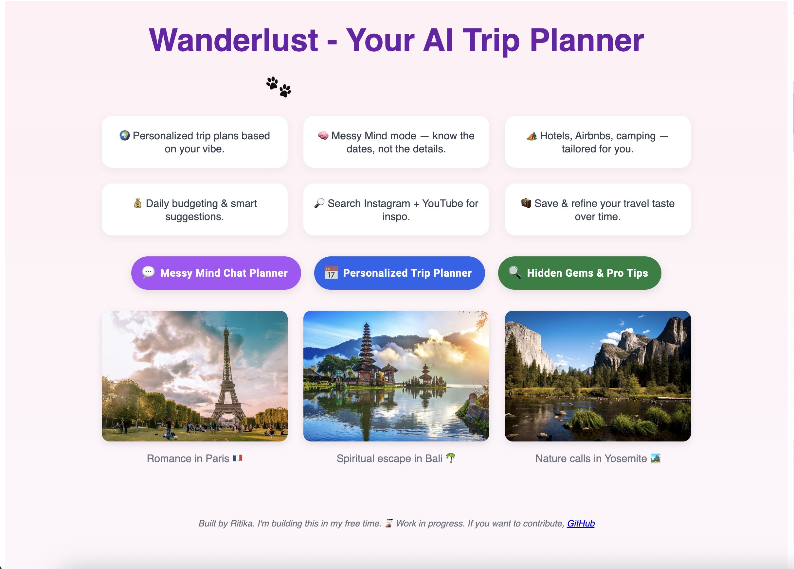

# Trip-Planner---Agentic-AI
Personalized trip plans based on your vibe.

## Overview

Trip-Planner---Agentic-AI is a personalized trip planning application that leverages AI to generate custom itineraries based on your preferences and vibe. The project is organized into two main folders:

- `frontend/` — Contains the web user interface.
- `backend/` — Contains the server-side logic and AI integration.

Each folder includes its own `README.md` file with detailed setup and run instructions.

## Local Development

To run the project locally, follow these steps:

1. Clone the Repository
2. Navigate to the `frontend` and `backend` directories and install the required dependencies for each. Follow the other steps

## Preview

